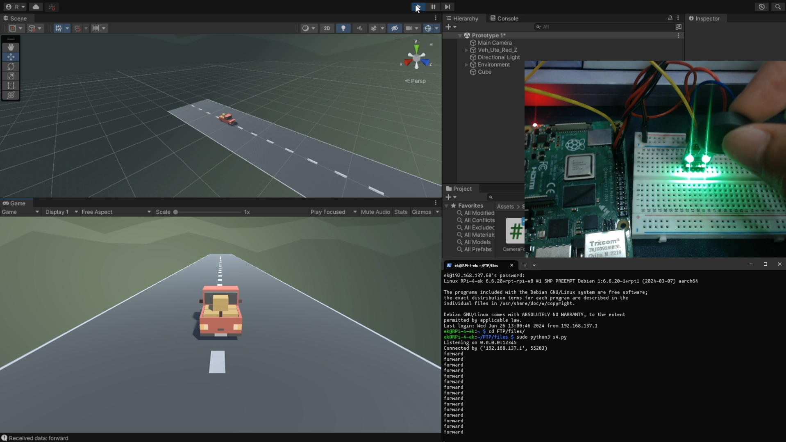
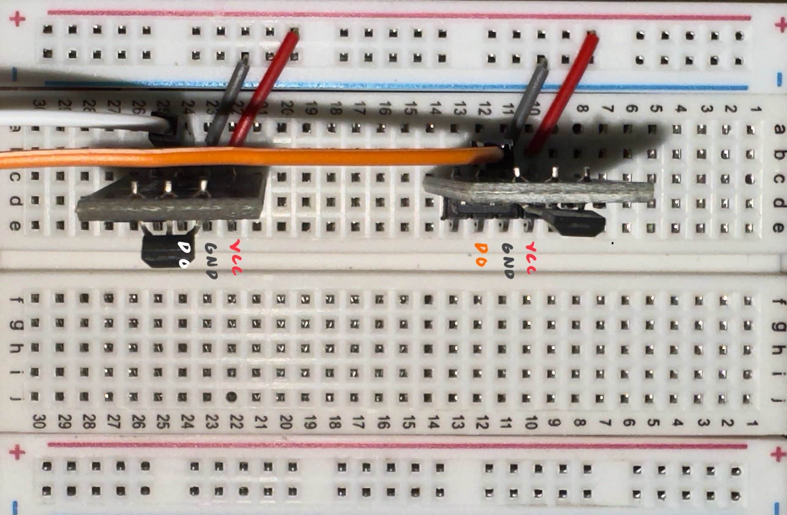

# RPi to Unity
A Raspberry Pi 4 Model B is configured to use two Hall effect sensors to send input data to a Unity game. The Hall effect sensors are connected via the RPi's GPIO and a Python script is used to detect magnetic fields. In the same Python script the use of web sockets was employed in order for the RPi to connect to the Unity game.


## Installation
Configure the Hall effect sensors on the RPi's GPIO ports and in the RPi-Python-HES.py


### APK
1. Install the .APK file to the android device
2. Run the RPi-Python-HES.py from the RPi.
3. Run the Android application in the android device
### Linux
1. Copy the 5_linux folder into the Linux device
2. Run the RPi-Python-HES.py from the RPi.
3. In the terminal execute the following
```
cd 5_linux
chmod +x linux.x86_64
./linux.x86_64
```
### WebGL
- Use Apache or NGINX to run the WebGL files to run locally
- itch.io and related sites can be used however I could not figure out how to connect the python script to the WebGL game as web sockets are not supported by WebGL

### Win32/64
1. Copy the 3_win32 or 4_win64 folder to the windows device
2. Run the RPi-Python-HES.py from the RPi.
3. Run the .exe file

## Credits
The DLSU IBEHT SIGLA Prototyping Team