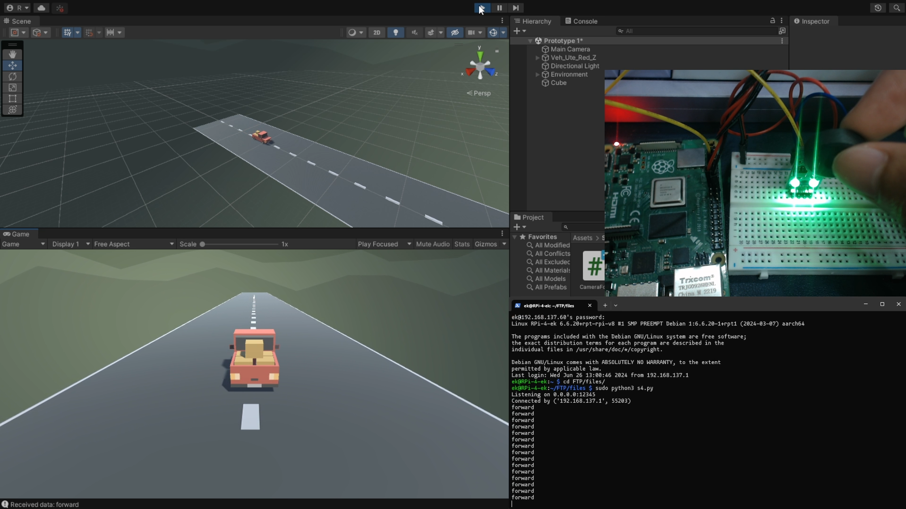
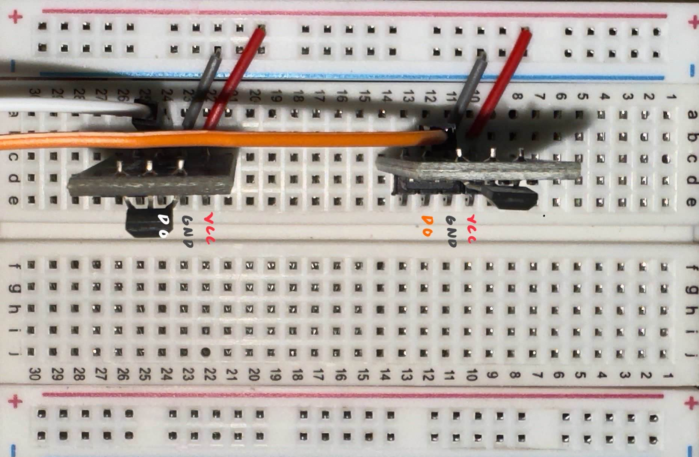

# RPi to Unity
A Raspberry Pi 4 Model B is configured to use two Hall effect sensors (HES) to send input data to a Unity game. The HES are connected via the RPi's GPIO and a Python script is used to detect magnetic fields. In the same Python script the use of web sockets was employed in order for the RPi to connect to the Unity game. Two HES were used to provide forward and backwards movement for the player in the Unity game.

## Installation
Configure the two HES on the RPi's GPIO ports and in the RPi-Python-HES.py. The **left** HES, used for forward movement, is connected to RPi GPIO 17, while the **right** HES, used for backward movement, is connected to RPi GPIO 27. GPIO 3v3 and ground were used for providing power to the circuit.

### Building the Application
In unity, the game must be built depending on the required application. The Raspberry Pi can support web apps via WebGL, linux executable, or a .APK if an Android OS is installed.
1. Run the RPi-Python-HES.py from the RPi.
2. Execute the Unity game (or open the WebGL app via a browser)
3. Control the vehicle by using a magnet on the Hall Effect Sensors.

### WebGL notes
- Use Apache or NGINX to run the WebGL files to run locally
- itch.io and related sites can be also be used
- A known issue **HOWEVER** is that WebSocket is not supported in WebGL

## Scripts
1. [RPi-Python-HES.py](./RPi-Python-HES.py) - RPi Hall effect sensors script
2. [CameraFollower.cs](./Unity%20Scripts/CameraFollower.cs) - Unity C# Script used for making the Camera follow the Player/Object
3. [DisplayIPAddress.cs](./Unity%20Scripts/DisplayIPAddress.cs) - Unity C# Script used to display (TextMeshPro) the Public and Local IPv4 Adress of the Host running the Unity game
4. [SocketListener.cs](./Unity%20Scripts/SocketListener.cs) - Unity C# Script used to receive the data from the RPi to translate movements of the player via sockets
5. [UnityMainThreadDispatcher.cs](./Unity%20Scripts/UnityMainThreadDispatcher.cs) - Unity C# Script to allow actions to be executed on the Unity main thread, even if they were initiated from a different thread.

## Credits
- The DLSU IBEHT SIGLA Prototyping Team  
- Free Unity game assets

## Languages and Tools:</h3>

  
